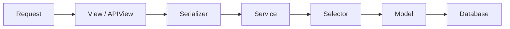

# Smart Ordering System (SOS)

Smart Ordering System (SOS) is an order management system that lets a restaurant/cafe create orders, manage their live status, assign staff, delete orders, and generate invoices — with a menu system driving what can be ordered.

## Features

- Add an order by picking items from the menu and building a cart (`Items` is a JSON list of `{menu_id, name, size, unit_price, qty, subtotal}`).
- View all orders on one screen, filterable by status (Live / Delivered).
- Track each order's lifecycle: `Preparing → Accepted → Ready To Collect → Delivered`.
- Assign a staff member to an order.
- Track payment type (Online/Offline) and payment status (Pending/Paid).
- Built-in invoice generator that renders a printable invoice per order.
- Menu CRUD (create, edit, delete, list) independent of orders.

## Folder Structure

```text
ORDERING SYSTEM DEMO
├── README.md
├── src/                          # Frontend (vanilla HTML/CSS/JS)
│   ├── index.html
│   ├── css/
│   │   ├── style.css
│   │   └── menu.css
│   └── js/
│       ├── api.js                # fetch wrapper for all backend calls
│       ├── main.js                # orders screen logic
│       └── menu.js                # menu management screen logic
│
└── SOS/                          # Backend (Django + DRF)
    ├── manage.py
    ├── db.sqlite3
    ├── SOS/                       # Project config
    │   ├── settings.py
    │   ├── urls.py                 # mounts /admin/ and /demo/ (-> Demo.urls)
    │   ├── asgi.py
    │   └── wsgi.py
    └── Demo/                      # The app — everything lives here
        ├── models/
        │   ├── orders.py
        │   └── menu.py
        ├── selectors/
        │   ├── order_selector.py
        │   └── menu_seletor.py
        ├── serializer/
        │   ├── order_serializer.py
        │   └── menu_serializers.py
        ├── services/
        │   ├── order_services.py
        │   ├── menu_services.py
        │   └── invoice_services.py
        ├── views/
        │   ├── order_views.py
        │   ├── menu_views.py
        │   └── invoice_views.py
        ├── templates/
        │   └── invoice.html
        ├── migrations/
        ├── urls.py
        ├── admin.py
        ├── apps.py
        └── tests.py
```

## Backend Architecture

The backend is a Django + Django REST Framework project (`corsheaders` enabled, all origins allowed for local dev, SQLite database). It follows a layered/service architecture instead of putting logic directly in views:



Each layer has a single job:

| Layer | Job |
|---|---|
| **View** | Receives the HTTP request, hands data to the serializer, calls the service, shapes the `Response`. No business logic here. |
| **Serializer** | Validates and cleans incoming request data (DRF `ModelSerializer`). |
| **Service** | Owns the business logic — building order totals, applying edits, generating invoice data. |
| **Selector** | Owns all read queries — the only place `Model.objects...` queries are written for reads. |
| **Model** | Defines the database table via Django ORM. |

This separation means, for example, that if a query needs to change (e.g. add a filter), it only needs to change in the selector — not in every view or service that needs that data.

## Models

### `models/menu.py` — `Menu`
Represents one item on the menu.

| Field | Type | Notes |
|---|---|---|
| `ItemName` | CharField | Name of the dish |
| `ItemQuantity` | CharField (choices) | `Half` / `Full` |
| `ItemPrice` | DecimalField | Must be ≥ 0.01 |
| `created_at` | DateTimeField | Auto-set on creation |

### `models/orders.py` — `Order`
Represents one customer order.

| Field | Type | Notes |
|---|---|---|
| `CustName` | CharField | Customer name |
| `Phone` | CharField | Customer phone |
| `Items` | JSONField | List of ordered items (built by the order service, not sent raw) |
| `Total` | DecimalField | Computed from `Items`, must be ≥ 0.01 |
| `Car_number` | CharField | For drive-through/parking orders |
| `Table_number` | PositiveIntegerField | For dine-in orders |
| `Status` | CharField (choices) | `Preparing` / `Accepted` / `Ready To Collect` / `Delivered` — defaults to `Preparing` |
| `Staff` | CharField | Staff member assigned to the order |
| `Payment_Status` | CharField (choices) | `Pending` / `Paid` |
| `Payment_Type` | CharField (choices) | `Online` / `Offline` |
| `created_at` | DateTimeField | Auto-set on creation |

## Selectors (read queries only)

### `selectors/menu_seletor.py`
- `get_menu_items()` — returns all `Menu` rows.
- `get_menu_by_id(menu_id)` — returns a single `Menu` row.

### `selectors/order_selector.py`
- `get_order_by_id(order_id)` — returns a single `Order` row.
- `get_order_by_status(status)` — returns all orders with a given status.
- `get_order()` — returns all `Order` rows.

## Services (business logic)

### `services/menu_services.py` — `Menu_Service`
- `add_menu_item(validated_data)` — creates a new `Menu` row.
- `edit_menu_item(item_id, validated_data)` — updates only the fields provided; uses `update_fields` so unrelated columns aren't touched.
- `get_menu()` — returns all menu items (delegates to the selector).
- `delete_menu_item(menu_id)` — deletes an item and returns a confirmation message.

### `services/order_services.py` — `Order_Service`
- `build_order_items(Items)` — the core cart logic: for each `{menu_id, qty}` sent by the frontend, it looks up the live menu item, computes `subtotal = ItemPrice * qty`, and returns a fully-priced item list plus a running `Total`. This means prices are always sourced from the current menu, not trusted from the client.
- `create_order(validated_data)` — builds the order items/total via `build_order_items`, then creates the `Order` row.
- `update_order(order_id, validated_data)` — patches an existing order. If the request includes new `Items`, it rebuilds `Items` and `Total` from scratch so the bill never goes stale; otherwise it just updates whichever fields were sent (e.g. a status-only update).
- `get_order(status)` — fetches orders by status (excludes `Delivered` from this particular path).
- `delete_order(order_id)` — deletes an order and returns a confirmation message.
- `order_list()` — returns all orders.
- `order_details(order_id)` — returns a single order reshaped into a clean, human-readable dict (customer name, items, bill, status, staff, etc.) — this is what powers the order-details view.

### `services/invoice_services.py` — `Invoice_Service`
- `generate_bill(order_id)` — builds an invoice dict (`invoice_number` formatted as `INV-00001`, customer info, items, total, order status/payment info) from a single order, ready to be rendered as HTML.

## Serializers

- `serializer/menu_serializers.py` — `Menu_Serializer`: validates `ItemName`, `ItemQuantity`, `ItemPrice` for the `Menu` model.
- `serializer/order_serializer.py` — `Order_Serializer`: validates all order fields; `CustName` and `Items` are required.

## Views (API endpoints)

### `views/menu_views.py`
| Class | Method | Purpose |
|---|---|---|
| `Create_menu_item` | POST | Create a menu item |
| `Edit_menu_item` | PATCH | Edit an existing menu item |
| `Delete_menu_item` | DELETE | Delete a menu item |
| `Menu_list_item` | GET | List all menu items |

### `views/order_views.py`
| Class | Method | Purpose |
|---|---|---|
| `Create_Order_Api` | POST | Create a new order |
| `Update_Order_Api` | PATCH | Update an order (status, staff, items, etc.) |
| `Order_List_Api` | GET | List all orders |
| `Order_Detail_Api` | GET | Get full details of one order |
| `Delete_Order_Api` | DELETE | Delete an order |

### `views/invoice_views.py`
| Function | Method | Purpose |
|---|---|---|
| `generate_invoice` | GET | Renders `invoice.html` with the invoice data for one order (not a DRF API view — a plain Django template view, since it returns HTML instead of JSON) |

## URL Routes

Mounted under `/demo/` (see `SOS/urls.py`, which also exposes `/admin/`):

```
POST    /demo/create_order/
PATCH   /demo/update_order/<order_id>/
GET     /demo/order_details/<order_id>/
GET     /demo/order_list/
DELETE  /demo/delete_order/<order_id>/

POST    /demo/create_item/
GET     /demo/menu_list/
PATCH   /demo/update_menu/<item_id>/
DELETE  /demo/delete_menu/<item_id>/

GET     /demo/generate_invoice/<order_id>/
```

## Frontend

Plain HTML/CSS/JS (no framework/build step):

- `index.html` — main app shell: header with "Menu" and "+ New Order" buttons, a live/delivered filter, and loading/error/empty states for the order list.
- `js/api.js` — thin fetch wrapper around the backend endpoints above.
- `js/main.js` — drives the orders screen: rendering the order list, filtering by status, opening/updating orders.
- `js/menu.js` — drives the menu management screen: listing, adding, editing, and deleting menu items.
- `css/style.css` — global app styling.
- `css/menu.css` — styling specific to the menu management screen.

## Tech Stack

- **Backend:** Django, Django REST Framework, `django-cors-headers`, SQLite
- **Frontend:** HTML, CSS, vanilla JavaScript (fetch API)

## Running Locally

```bash
cd SOS
python manage.py migrate
python manage.py runserver
```

Then open `src/index.html` in a browser (or serve it with any static file server) — it talks to the Django API at `/demo/...`.

## Notes / Known Gaps (things to revisit)

- `requirements.txt` is referenced in the original folder plan but isn't in the project yet — worth adding (`django`, `djangorestframework`, `django-cors-headers`).
- `Order_Service.get_order(status)` will raise an `UnboundLocalError` if `status == "Delivered"`, since `order` is only assigned in the `if` branch.
- `Staff` on `Order` has no `max_length`, which Django requires for a `CharField` — this will fail migrations/validation until a length is added.
- CORS is fully open (`CORS_ALLOW_ALL_ORIGINS = True`) — fine for local demo, should be locked down before any real deployment.